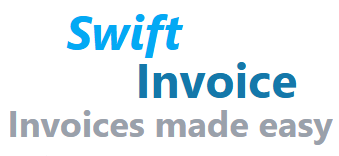
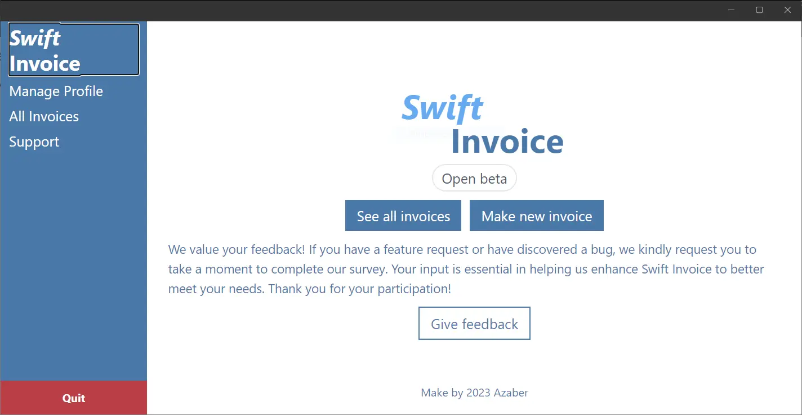

# Swift Invoice

Invoicing software focused on being easy and quick to use.

## Screenshots



## Tech Stack

**Frontend:** Blazor, Tailwindcss.

**Backend:** .NET.

**Database:** SQLite.

**Dev Ops Tools:** N/A.

**Deployment Platform**: Windows.

## Run Locally

### Prerequisites

- .NET 8 SDK.
- Visual Studio 2022 or later.

### Installation

Clone the project from branch desktop-app

```bash
  git clone https://github.com/Azab-Inc/SwiftInvoice.git
```

Open UniversalApp folder and open .sln

```bash
  cd UniversalApp
  UniversalApp.sln
```

Install dependencies

```bash
  npm i --force
  dotnet clean && dotnet restore
```

Run tailwind compiler

```bash
  cd wwwroot
```

```bash
  npx tailwindcss -i input.css -o output.css --watch

  or

  runTailwind.sh
```

Running the app

Start the app with the play button in Visual Studio

## Running Tests

Only manual tests are available at this time.

## Team

| Person             | Role                 |
| ------------------ | -------------------- |
| Alexander Zaborski | Full Stack Developer |

## Support

| Person             | Role                 | Email           | Contact links                       |
| ------------------ | -------------------- | --------------- | ----------------------------------- |
| Alexander Zaborski | Full Stack Developer | info@azaber.com | https://www.linkedin.com/in/azaber/ |
